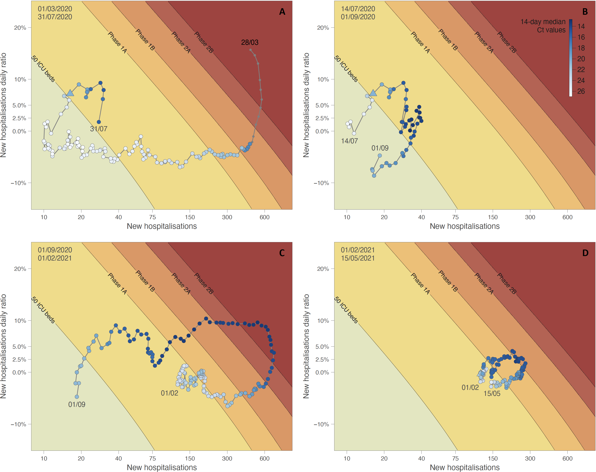

This repo gathers the input files and scripts related to our study entitled "**Leveraging of SARS-CoV-2 PCR Cycle Thresholds Values to Forecast COVID-19 Trends**" ([Yin, Dellicour *et al*. 2021](https://www.frontiersin.org/journals/medicine/articles/10.3389/fmed.2021.743988/full), *Frontiers in Medicine*). The Ct data are all gathered in the file `Data_LHUB-ULB_200521.csv`. The R script `R_scripts_for_Ct_analyses.r` is divided into different sections allowing to perform the following analytical steps: (1) estimating the median and mean Ct values through time, (2) co-plotting the mean Ct values on phase diagrams\*, and (3) plotting the median and mean Ct values through time. (\*) the phase diagrams are generated according to Hens *et al*. (2021, *Archives of Public Health*). In addition, we also gathered within the subdirectory "Ct_values_Analyses_by_age" the R script and files required to run specific analyses by age category.

Abstract: We assessed the usefulness of SARS-CoV-2 RT-PCR cycle thresholds (Ct) values trends produced by the LHUB-ULB (a consolidated microbiology laboratory located in Brussels, Belgium) for monitoring the epidemic's dynamics at local and national levels and for improving forecasting models. SARS-CoV-2 RT-PCR Ct values produced from April 1, 2020, to May 15, 2021, were compared with national COVID-19 confirmed cases notifications according to their geographical and time distribution. These Ct values were evaluated against both a phase diagram predicting the number of COVID-19 patients requiring intensive care and an age-structured model estimating COVID-19 prevalence in Belgium. Over 155,811 RT-PCR performed, 12,799 were positive and 7,910 Ct values were available for analysis. The 14-day median Ct values were negatively correlated with the 14-day mean daily positive tests with a lag of 17 days. In addition, the 14-day mean daily positive tests in LHUB-ULB were strongly correlated with the 14-day mean confirmed cases in the Brussels-Capital and in Belgium with coinciding start, peak, and end of the different waves of the epidemic. Ct values decreased concurrently with the forecasted phase-shifts of the diagram. Similarly, the evolution of 14-day median Ct values was negatively correlated with daily estimated prevalence for all age-classes. We provide preliminary evidence that trends of Ct values can help to both follow and predict the epidemic's trajectory at local and national levels, underlining that consolidated microbiology laboratories can act as epidemic sensors as they gather data that are representative of the geographical area they serve.

**Figure: phase diagram generated for different time periods: situation from March 1 to July 14, 2020 (A), situation from July 14 to September 1, 2020 (B), and situation from September 1, 2020, to February 1, 2021 (C), situation from February 1 until May 15, 2021 (D).** See the text for further detail on the principle of phase diagrams. Dots of the phase diagram are coloured according to 14-day median Ct values (thus computed using a backward sliding window of 14 days, from May 1, 2020). Triangle symbols indicate the dates when Ct values crossed down the threshold value of 22.3.
